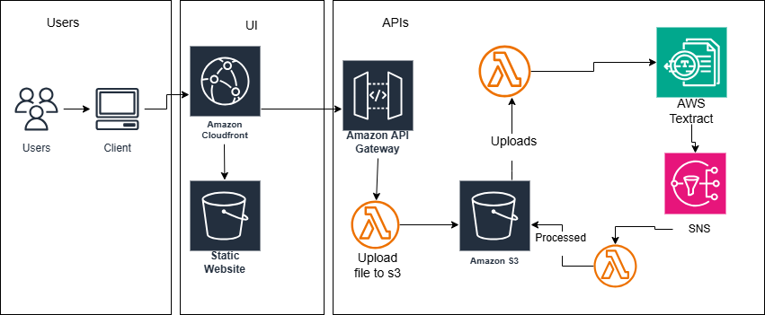

# PDF-processing
Serverless PDF Processing with AWS Lambda and Textract.

# Overview
AWS Textract is a powerful service that automates the extraction of text and data from documents like PDFs.
It's a serverless, fully managed by amazon and it's far more cost-effective than training or using an AI model.

When combined with AWS lambda and S3, Textract can be triggered automatically whenever a document is uploaded, enabling real-time processing without the hassle of manging infrastructure. 

# Front-End
Clients will be able to access our static web page distributed through Amazon CloudFront and hosted on S3 bucket. The clients will be able to upload the pdf file through an API gateway which triggers a lambda function which actually uploads the file to an S3 bucket.

# Asynchronous Implementation
After uploading the pdf file to a uploads folder on s3 bucket, a lambda fucntion will be triggered to process the file through an AWS Textract. Upon completion, the Textract event will trigger a second lambda function through SNS. This lambda function will parse out the results and save the text from the pdf file as a text file to the processed folder of our S3 bucket.

## Infrastructure
The infrastructure of our project:

## The steps
1. Upload: Users upload documents, such as PDFs or scanned images, to an Amazon S3 bucket in the uploads folder.
2. Lambda Trigger via S3 Notification: When a document is uploaded to the S3 bucket, it triggers an AWS Lambda function via an S3 notification.
3. Textract Processing: The triggered Lambda function calls AWS Textract, which processes the document.
4. Lambda Trigger via an SNS: Once Textract completes the document processing, it sends a message to AWS SNS, which triggers another Lambda function.
5. Post-Processing: the second Lambda function can further process the extracted data by formatting it into a structured format (e.g., JSON, CSV) and storing it in an S3 bucket or a database like Amazon RDS or DynamoDB for easy retrieval and analysis.

